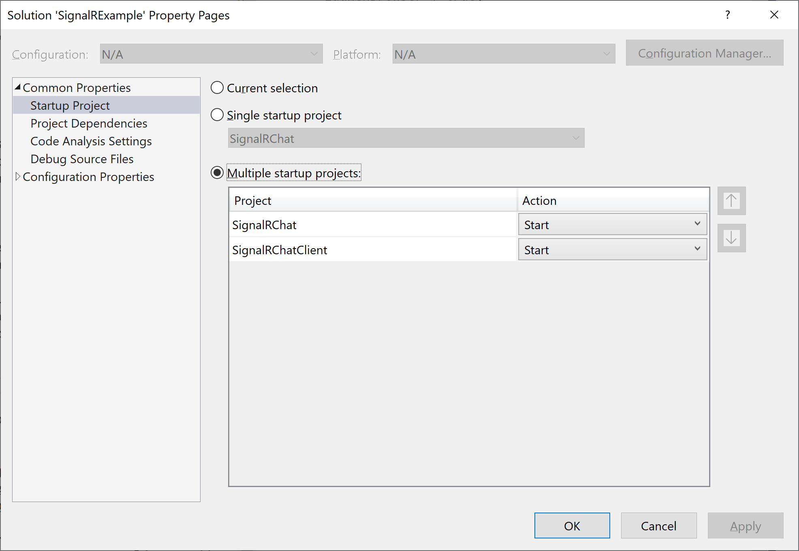
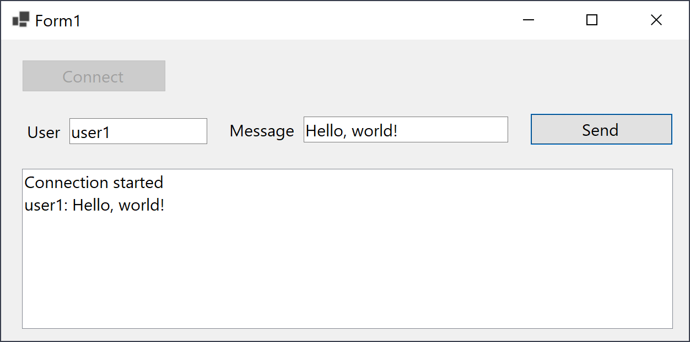

# Windows Forms SignarR client for a ASP.NET Core SignarlR server 

Here is an example on how to send and receive SignalR messages in a Windows Forms application. In this example, the chat server app is an ASP.NET Core Web application, and the client app is a Windows Forms Application.

You can just clone the repository, or you can follow the step by step guide to write the example yourself.

## Step by step guide

**1 - Create the host application**

1. Create an ASP.NET Core Web application, with name `SignalRChat`. (Enable HTTPS, and use .NET 6)
2. Create a folder in the project, with name `Hubs`. And add a new file to it, `ChatHub.cs`, with the following content: 

       using Microsoft.AspNetCore.SignalR;
   
       namespace SignalRChat.Hubs
       {
           public class ChatHub : Hub
           {
               public async Task SendMessage(string user, string message)
               {
                   await Clients.All.SendAsync("ReceiveMessage", user, message);
               }
           }
       }
3. Add SignalR configuration to the Program.cs. Here's the file content after the config added:

       using SignalRChat.Hubs;
   
       var builder = WebApplication.CreateBuilder(args);
   
       // Add services to the container.
       builder.Services.AddRazorPages();
       builder.Services.AddSignalR();
   
       var app = builder.Build();
   
       // Configure the HTTP request pipeline.
       if (!app.Environment.IsDevelopment())
       {
           app.UseExceptionHandler("/Error");
           app.UseHsts();
       }
   
       app.UseHttpsRedirection();
       app.UseStaticFiles();
   
       app.UseRouting();
   
       app.UseAuthorization();
   
       app.MapRazorPages();
       app.MapHub<ChatHub>("/chatHub");
   
       app.Run();

**2 - Create the client application**

1. Create a new WinForms application (.NET 6), with name `SignalRChatClient`.
2. Drop a button, with name `connectButton` 
3. Drop a button, with name `sendButton`
4. Drop a textBox, with name `userTextBox`
5. Drop a textBox, with name `messageTextBox`
6. Drop a listBox, with name `messagesList` 
7. Double click on `connectButton` to add the empty event handler to the form. We will add the body later.
8. Double click on `sendButton` to add the empty event handler to the form. We will add the body later.
9. Replace the Form1.cs content with the following content: 
       using Microsoft.AspNetCore.SignalR.Client;
       
       namespace SignalRChatClient
       {
           public partial class Form1 : Form
           {
               HubConnection connection;
               public Form1()
               {
                   InitializeComponent();
                   connection = new HubConnectionBuilder()
                      .WithUrl("https://localhost:7142/ChatHub")
                      .WithAutomaticReconnect()
                      .Build();
               }
       
               private async void connectButton_Click(object sender, EventArgs e)
               {
                   connection.On<string, string>("ReceiveMessage", (user, message) =>
                   {
                       this.Invoke((Delegate)(() =>
                       {
                           var newMessage = $"{user}: {message}";
                           messagesList.Items.Add(newMessage);
                       }));
                   });
       
                   try
                   {
                       await connection.StartAsync();
                       messagesList.Items.Add("Connection started");
                       connectButton.Enabled = false;
                       sendButton.Enabled = true;
                   }
                   catch (Exception ex)
                   {
                       messagesList.Items.Add(ex.Message);
                   }
               }
       
               private async void sendButton_Click(object sender, EventArgs e)
               {
                   try
                   {
                       await connection.InvokeAsync("SendMessage",
                           userTextBox.Text, messageTextBox.Text);
                   }
                   catch (Exception ex)
                   {
                       messagesList.Items.Add(ex.Message);
                   }
               }
           }
       }
10. **Important!:** Make sure you modify the URL to the value for your environment. To do so, you can run the web app and see the URL in the browser, or you can open launchSettings.json file and see the URL based on the profile. I'm debugging in VS, so I used the URL `https://localhost:7142` from this node:

        "profiles": {
         "SignalRExample": {
           "commandName": "Project",
           "dotnetRunMessages": true,
           "launchBrowser": true,
           "applicationUrl": "https://localhost:7142;http://localhost:5142",
           "environmentVariables": {
             "ASPNETCORE_ENVIRONMENT": "Development"
           }
         },

**3 - Set multiple Strartup and run**

1. Right click on the solution and choose Properties
2. In the start up projects, choose Multiple Startup Projects and for both SignalRChat and SignalRChatClient choose Start, and save changes.
  

Now you can press <kbd>F5</kbd> and run the project. Wait until the web browser opens and navigates to the web app. The Windows Form will also open and Form1 will be shown.

Press on Connect button, then after seeing the "Connection started" message in the list, type a username and a message in the text boxes and press Send, and you will receive the message in the list.

 

## References

Two docs & learn article which will help you to create a SignalR server and client:

- Step by step article on creating a SignarR server app: [Get started with ASP.NET Core SignalR](https://learn.microsoft.com/en-us/aspnet/core/tutorials/signalr?view=aspnetcore-7.0&tabs=visual-studio&WT.mc_id=DT-MVP-5003235)
- Creating the client app, and the error handling, reconnecting, and other related topics: [ASP.NET Core SignalR .NET Client](https://learn.microsoft.com/en-us/aspnet/core/signalr/dotnet-client?view=aspnetcore-7.0&tabs=visual-studio&WT.mc_id=DT-MVP-5003235).
